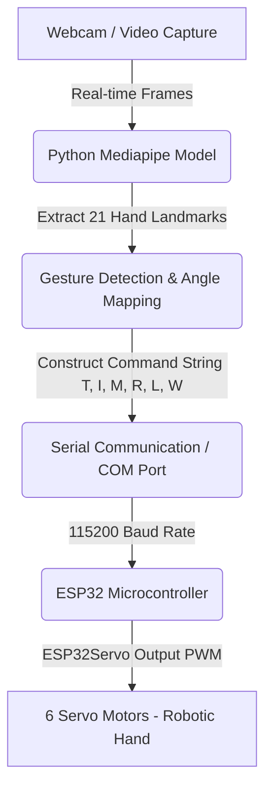

# MIMIC-BOT: A Wireless Tele-Robotic System via Hand Landmark Tracking 🤖✋

A state-of-the-art wireless tele-robotic hand system that mirrors human hand gestures in real-time. By utilizing **Computer Vision (MediaPipe & OpenCV)** for hand landmark tracking, the system captures gestures and translates them into control commands. These commands are transmitted wirelessly/serially to an **ESP32 microcontroller**, which controls a robotic hand configured with **6 servo motors** (5 for fingers, 1 for wrist).

---

## 📸 System Overview & Architecture

The system works as a closed-loop tele-robotic control interface:



### Key Components:
- **Computer Vision Pipeline**: Uses Google's **MediaPipe Hands** to track 21 3D landmarks on a single hand at high FPS.
- **Actuation Control**: Features an **ESP32** utilizing the `ESP32Servo` library to control the joints smoothly.
- **Communication Protocol**: A custom, lightweight telemetry format (`T:theta, I:theta, M:theta, R:theta, L:theta, W:theta`) sent over serial.

---

## 🛠️ Hardware Setup

### Microcontroller: ESP32
The servo motors are connected directly to the ESP32 GPIO pins:

| Servo | Finger / Joint | ESP32 GPIO Pin |
|---|---|---|
| **Thumb** | Thumb flexion/extension | `GPIO 12` |
| **Index** | Index finger flexion/extension | `GPIO 14` |
| **Middle** | Middle finger flexion/extension | `GPIO 25` |
| **Ring** | Ring finger flexion/extension | `GPIO 26` |
| **Little** | Little finger flexion/extension | `GPIO 27` |
| **Wrist** | Wrist rotation/tilt | `GPIO 33` |

*Ensure you use an external power supply (e.g., 5V/3A) for the servo motors, as the ESP32's onboard regulator cannot supply enough current for 6 servos simultaneously.*

---

## 💻 Software & Installation

### Python Setup (Laptop/PC)
1. Clone this repository to your local machine.
2. Install the required Python dependencies:
   ```bash
   pip install opencv-python mediapipe pyserial
   ```
3. Locate the serial port for your ESP32 (e.g., `COM8` on Windows, `/dev/ttyUSB0` on Linux/macOS) and update the port in `finger_status.py`:
   ```python
   ser = serial.Serial('COM8', 115200, write_timeout=0.1)
   ```

### Arduino Setup (ESP32)
1. Open the Arduino IDE.
2. Install the **ESP32Servo** library via the Library Manager.
3. Open `ESP_32_mimic_bot/ESP_32_mimic_bot.ino`.
4. Select your ESP32 board and port, then upload the sketch.

---

## 🚀 Running the System

1. **Upload** the Arduino code to the ESP32.
2. **Connect** the ESP32 to your PC via a USB cable.
3. Run the hand detection test script to verify your camera works:
   ```bash
   python hand_test.py
   ```
4. Run the main control program to start transmitting real-time movements to the robotic hand:
   ```bash
   python finger_status.py
   ```
5. Press **'q'** in the camera preview window to quit the application.

---

## 📂 Project Structure

```
mimic_bot/
├── ESP_32_mimic_bot/
│   └── ESP_32_mimic_bot.ino      # ESP32 firmware for receiving serial commands and driving servos
├── finger_status.py               # Main control script: landmark tracking, mapping, and serial transmission
├── hand_test.py                   # Testing script for camera and basic hand landmark detection
├── .gitignore                     # Git ignore rules
└── README.md                      # Project documentation
```

*Note: The project folder also contains system flowchart diagrams, layout graphics, and the project thesis PDF explaining the complete research and engineering behind the Mimic Bot.*

---

## 🎓 Academic Credit & Thesis
This project is part of a thesis work by **DHRUV** titled:
**"MIMIC-BOT: A WIRELESS TELE-ROBOTIC SYSTEM VIA HAND LANDMARK TRACKING"**

Detailed information about the design decisions, power supply monitoring, link analysis, and mechanical assembly can be found in the attached **`Thesis final - DHRUV .pdf`**.
